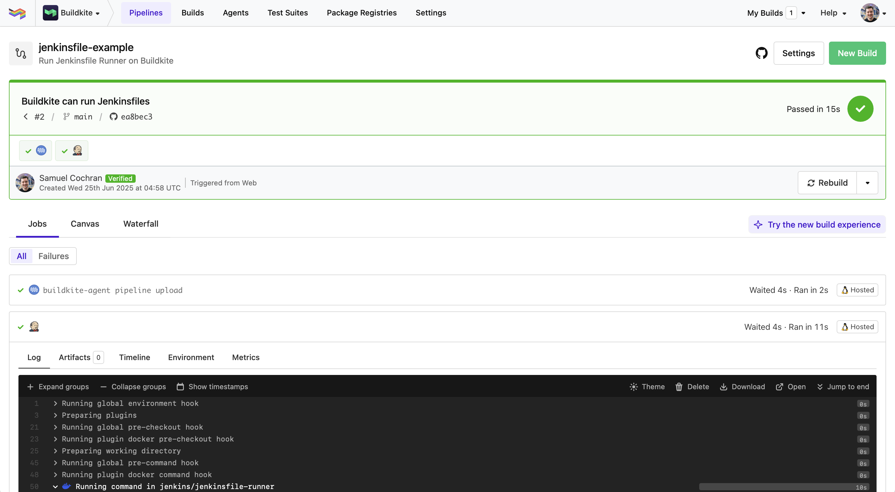

# Run Jenkinsfile on Buildkite

Use [Jenkinsfile Runner][jenkinsfile-runner] to run a Jenkinsfile on a [Buildkite Agent][buildkite-agent].

This repository is checked out by the Buildkite Agent. It then runs the Jenkinsfile using Jenkinsfile Runner via [a Docker image][jenkinsfile-runner-image], using the [Docker Buildkite Plugin][docker-buildkite-plugin], with the checkout mounted inside.

This example is basic, but illustrates the idea - anything the Jenkinsfile might need could be added to an image atop the Jenkinsfile Runner. [Jenkinsfile Runner Image Packs][jenkinsfile-runner-image-packs] provide some existing examples.

  [jenkinsfile-runner]: https://github.com/jenkinsci/jenkinsfile-runner
  [buildkite-agent]: https://buildkite.com/docs/agent
  [jenkinsfile-runner-image]: https://hub.docker.com/r/jenkins/jenkinsfile-runner
  [docker-buildkite-plugin]: https://github.com/buildkite-plugins/docker-buildkite-plugin
  [jenkinsfile-runner-image-packs]: https://github.com/jenkinsci/jenkinsfile-runner-image-packs

Try it yourself:

